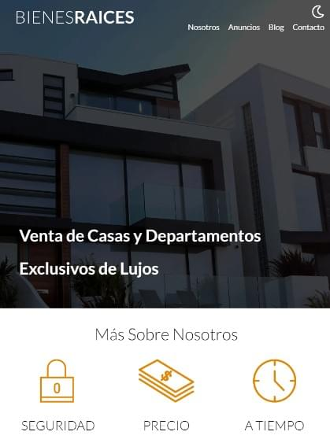

# Web Bienes Raíces

## Introduction
This is a practice project designed to enhance my skills in HTML, CSS with SASS, and JavaScript, utilizing Gulp to compile SASS and optimize image formats. The project uses dev dependencies in an npm environment and manages additional libraries with Composer. Additionally, it incorporates PHP and SQL to handle user information.

The goal of this project is to develop a real estate website featuring a logo and navigation bar within a hero section at the top of the page. Below that, the website includes various sections, such as About Us, Property Ads for Sale, a graphic section with a contact button, and a blog with testimonials. Each section has its own dedicated page with detailed information.

The project follows the Model View Controller (MVC) architecture to ensure a better code structure, improved scalability, and maintainability.

Additionally, the website provides functionality for managing property ads and sellers, allowing admin users to create, modify, and delete ads and seller information using database CRUD operations.


## Screenshots

<p align="center">
    <picture>
        <source srcset="src/img/screenshots/screenshot6.webp" type="image/webp">
        
    </picture>
    <picture>
        <source srcset="src/img/screenshots/screenshot2.webp" type="image/webp">
        
    </picture>
    <picture>
        <source srcset="src/img/screenshots/screenshot3.webp" type="image/webp">
        
    </picture>
    <picture>
        <source srcset="src/img/screenshots/screenshot4.webp" type="image/webp">
        
    </picture>
    <picture>
        <source srcset="src/img/screenshots/screenshot5.webp" type="image/webp">
        
    </picture>
    <picture>
        <source srcset="src/img/screenshots/screenshot6.webp" type="image/webp">
        
    </picture>
    <picture>
        <source srcset="src/img/screenshots/screenshot7.webp" type="image/webp">
        
    </picture>
    <picture>
        <source srcset="src/img/screenshots/screenshot8.webp" type="image/webp">
        
    </picture>
    <picture>
        <source srcset="src/img/screenshots/screenshot9.webp" type="image/webp">
        
    </picture>
    <picture>
        <source srcset="src/img/screenshots/screenshot10.webp" type="image/webp">
        
    </picture>
</p>

## Features
- Model View Controller (MVC) architecture.
- Database connection with CRUD operations.
- Dark mode for all pages.
- Navigation bar with links to different sections.
- Hero section with background image.
- Responsive pages for optimal viewing on all devices.

Website Sections:
- About Us.
  - Dedicated page with detailed information about the company.
- Property Ads for Sale.
  - Individual pages for each property with more detailed information.
- Contact.
  - Dedicated page with more contact options.
- Blog with testimonials.
  - Dedicated pages for each blog post with detailed information
- Footer with logo and navigation bar.

Admin Panel:
- Login page for admins.
  - Admin dashboard page with all properties and sellers' data from the database.
  - Pages to create, update, and delete properties and sellers.


## Technologies
   
   


## Installation

1. Clone this repository:
```bash
git clone https://github.com/FernandoMercado-Dev/web_BienesRaices-ES.git
```
2. Navigate to the project folder
3. Install the project dependencies (Composer, Node.js, and npm are required):
```bash
npm install
```
and:
```bash
composer install
```
4. In case of a change, to compile and run the project, use the following command:
```bash
npm run dev
```
5. For run the project with php localhost go to public folder and form ther in a terminal use:
```bash
php -S localhost:3000
```